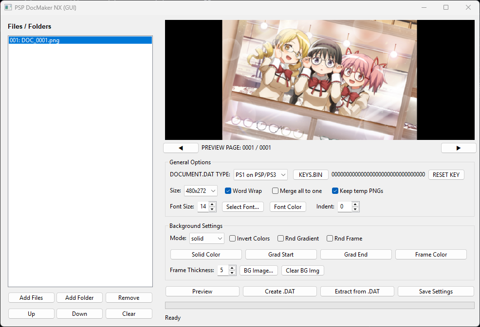

# PSPDocMakerGUI

An easy-to-use graphical tool for creating properly formatted DOCUMENT.DAT (manual) files for PS1, PSP, and PS Minis games.

## Features

- Preview
- Support for various encodings of input text files .txt: UTF-8, ANSI, WIN, DOS, KOI-8, Macintosh.
- Output image size: 480x248, 480x272, 480x480 or 480x960
- Words wrap by image width (can be disabled).
- Support for in-text tags: Page Break - @pb@
- Selecting font and font color
- Set background image: bmp, jpg, jpeg, png, gif. You can use any images, they are scaled.
- Background fill options: solid color, color gradient, gradient with a border and "Random style".
- Adjust the size of the text indentation from the screen borders.
